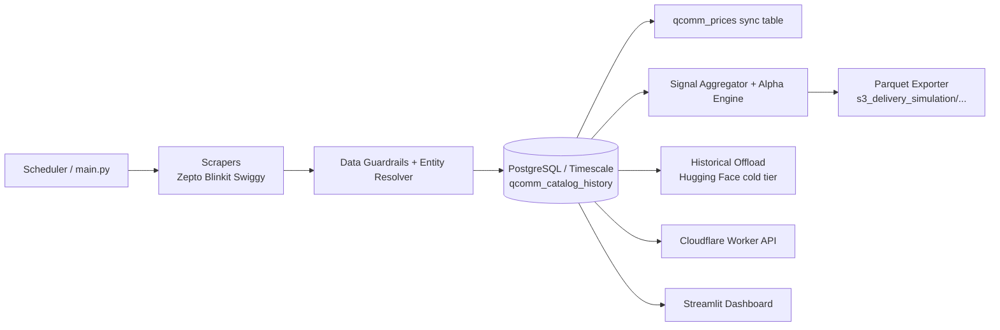

# aerodata-qcomm

[](https://www.python.org/downloads/release/python-3100/)
[](https://www.docker.com/)
[](https://streamlit.io/)
[](https://github.com/features/actions)

Institutional-grade quick-commerce alternative data pipeline for collecting, validating, and exporting **price**, **stockout**, and **catalog** signals from Zepto, Blinkit, and Swiggy Instamart across major Indian urban clusters.

---

## Table of Contents

- [Project Overview](#project-overview)
- [Key Features](#key-features)
- [Architecture](#architecture)
- [Project Structure](#project-structure)
- [Prerequisites](#prerequisites)
- [Installation](#installation)
- [Configuration](#configuration)
- [Usage](#usage)
  - [Run Pipeline Once](#run-pipeline-once)
  - [Run Scheduled Daemon](#run-scheduled-daemon)
  - [Run Dashboard](#run-dashboard)
  - [Run with Docker Compose](#run-with-docker-compose)
- [API and CLI Reference](#api-and-cli-reference)
  - [Python Entry Points](#python-entry-points)
  - [Cloudflare Worker API](#cloudflare-worker-api)
- [Data Outputs](#data-outputs)
- [Development Setup](#development-setup)
- [Testing and Validation](#testing-and-validation)
- [Deployment](#deployment)
- [Troubleshooting](#troubleshooting)
- [Contributing](#contributing)
- [Roadmap](#roadmap)
- [License](#license)
- [Acknowledgments](#acknowledgments)
- [Contact](#contact)

---

## Project Overview

`aerodata-qcomm` orchestrates a multi-platform ingestion workflow that:

1. Pulls storefront catalog payloads from quick-commerce platforms using browser impersonation and resilient networking.
2. Normalizes and validates records with guardrails and entity/ticker mapping logic.
3. Stores point-in-time observations in PostgreSQL/Timescale-compatible tables.
4. Computes institutional signals (brand stockout index, staples inflation proxy, alpha drift metrics).
5. Exports partitioned Parquet outputs into an S3-style directory layout.
6. Exposes operational analytics via a Streamlit dashboard and optional Cloudflare Worker API.

The codebase is designed around **daily scheduled ingestion**, **high-frequency regional snapshots**, and **quant-focused derived signals**.

---

## Key Features

- Multi-source ingestion for **Zepto**, **Blinkit**, and **Swiggy Instamart**
- Geospatial scanning across predefined Tier-1 urban clusters
- Network resiliency:
  - DNS fallback resolution
  - Proxy support with sticky session logic
  - Optional ADB-triggered mobile IP rotation
- Data quality controls:
  - Mandatory field checks
  - Price floor/ceiling constraints
  - Historical Z-score anomaly quarantine
- Point-in-time storage model (`observed_at` and `effective_at`)
- Signal generation:
  - Brand stockout rate index
  - Staples basket inflation index (DoD)
  - Alpha drift and stockout velocity analytics
- Export to partitioned Parquet (`year=YYYY/month=MM/day=DD/`)
- Monitoring & operations:
  - Heartbeat file
  - Rotating scheduler logs
  - Optional Discord/Telegram alerts
- Streamlit dashboard with regional filters and operational health views

---

## Architecture



---

## Project Structure

```text
aerodata-qcomm/
├── main.py                       # End-to-end ingestion orchestrator
├── scheduler.py                  # Daily scheduler daemon with retry/backoff
├── config.py                     # Base runtime configuration
├── requirements.txt              # Python dependencies
├── docker-compose.yml            # DB + scheduler + dashboard stack
├── Dockerfile                    # App image definition
├── deploy.sh                     # Docker-based deployment helper
├── scrapers/                     # Platform connectors, network/proxy/session logic
├── signals/                      # Signal computation, export, data quality tooling
├── database/                     # DB init and hot/cold archival routines
├── dashboard/                    # Streamlit monitoring and analytics app
├── spatial_config/               # Geospatial cluster definitions
├── cloudflare-worker/            # Optional edge API for alpha access
└── .github/workflows/            # Scheduled ingestion workflow automation
```

---

## Prerequisites

- Python **3.10+**
- PostgreSQL-compatible database (TimescaleDB recommended by project config)
- `pip`
- (Optional) Docker + Docker Compose
- (Optional) Node.js + npm (for Cloudflare Worker)
- (Optional) ADB tooling for mobile-network IP rotation workflows

---

## Installation

### 1) Clone and enter repository

```bash
git clone https://github.com/DevWizard-Vandan/aerodata-qcomm.git
cd aerodata-qcomm
```

### 2) Create and activate virtual environment

```bash
python -m venv .venv
source .venv/bin/activate  # Linux/macOS
# .venv\Scripts\activate   # Windows PowerShell
```

### 3) Install dependencies

```bash
pip install --upgrade pip
pip install -r requirements.txt
```

---

## Configuration

Create a `.env` file (or export environment variables) before running services:

```bash
DB_HOST=localhost
DB_PORT=5432
DB_USER=postgres
DB_PASSWORD=your_secure_password
DB_NAME=postgres

DATABASE_URL=                # optional override (used by DB connectors when set)

PROXY_URL=
PROXY_USER=
PROXY_PASS=

NOTIFICATION_PROVIDER=none   # none | discord | telegram
DISCORD_WEBHOOK_URL=
TELEGRAM_BOT_TOKEN=
TELEGRAM_CHAT_ID=
TELEGRAM_CUSTOM_GATEWAY=

HF_TOKEN=
HF_REPO_ID=

DASHBOARD_PASSWORD=admin123
```

### Notes

- `DATABASE_URL` takes precedence over individual DB variables where implemented.
- Default dashboard password fallback is `admin123` if not overridden.
- Cold-tier archival to Hugging Face is skipped when `HF_TOKEN` or `HF_REPO_ID` is missing.

---

## Usage

### Run Pipeline Once

```bash
python main.py
```

### Run Scheduled Daemon

Production mode (daily trigger at 23:30 IST):

```bash
python scheduler.py
```

Test mode (executes once after short delay, with second-level backoff):

```bash
python scheduler.py --test
```

### Run Dashboard

```bash
streamlit run dashboard/app.py
```

Open: `http://localhost:8501`

### Run with Docker Compose

```bash
docker compose up --build
```

Services:
- TimescaleDB: `localhost:5432`
- Streamlit dashboard: `http://localhost:8501`
- Scheduler daemon: containerized background service

---

## API and CLI Reference

### Python Entry Points

| Command | Purpose |
|---|---|
| `python main.py` | Execute full ingestion, validation, DB upsert, and signal export |
| `python scheduler.py` | Start long-running scheduler daemon |
| `python scheduler.py --test` | Run scheduler once in test mode |
| `python database/offload_historical.py` | Offload records older than 30 days to Hugging Face and purge hot table |
| `python scrapers/test_connection.py --url <target>` | Diagnostic endpoint connectivity test |

### Cloudflare Worker API

Located in `cloudflare-worker/` and configured via `wrangler.toml`.

- Endpoint: `GET /api/v1/alpha`
- Required header: `X-Alpha-Token: <token>`
- Backend query: latest 100 rows from `qcomm_catalog_history`

Example request:

```bash
curl -H "X-Alpha-Token: YOUR_TOKEN" \
  "https://<your-worker-domain>/api/v1/alpha"
```

> **Assumption/Placeholder:** Worker deployment URL/domain is environment-specific and not defined in this repository.

---

## Data Outputs

### Database tables

- `qcomm_catalog_history` (primary PIT history table)
- `qcomm_prices` (synced query-optimized table)

### Parquet signal artifacts

Output root:

```text
s3_delivery_simulation/year=YYYY/month=MM/day=DD/
```

Expected files per partition day:

- `brand_stockouts.parquet`
- `food_inflation_index.parquet`

---

## Development Setup

Recommended local workflow:

1. Start PostgreSQL/TimescaleDB (local or Docker).
2. Install Python dependencies.
3. Export `.env` values.
4. Run `python main.py` to initialize schema and produce sample outputs.
5. Launch dashboard for validation and exploration.

---

## Testing and Validation

Current repository status:

- No formal unit/integration test suite is configured.
- Basic Python module compile checks can be used for syntax validation:

```bash
python -m compileall .
```

- Script-level checks are present in certain modules (`if __name__ == "__main__"` blocks) for smoke verification.

---

## Deployment

### Option A: Scripted Docker deployment

```bash
chmod +x deploy.sh
./deploy.sh
```

### Option B: GitHub Actions scheduled workflow

Workflow file: `.github/workflows/scheduled_crawlers.yml`

- Nightly run trigger (`cron`) for primary ingestion
- Separate keep-alive trigger
- Includes ingestion and archival steps

### Option C: Cloudflare Worker (optional API edge)

```bash
cd cloudflare-worker
npm install
npx wrangler deploy
```

> **Assumption/Placeholder:** Cloudflare account setup, secrets binding, and production route mapping must be configured externally.

---

## Troubleshooting

- **DB connection errors**
  - Verify `DATABASE_URL` or `DB_*` values.
  - Ensure DB service is reachable on expected host/port.
- **No records exported**
  - Check scheduler/main logs in `logs/`.
  - Validate scraper responses and guardrail quarantine entries (`logs/quarantine.log`).
- **Dashboard shows fallback/mock data**
  - Confirm hot-tier DB access and optional Hugging Face cold-tier token/repo settings.
- **Worker unauthorized responses**
  - Validate `X-Alpha-Token` header matches deployed `ALPHA_API_KEY`.
- **Proxy-related failures**
  - Verify `PROXY_URL`, credentials, and connectivity.

---

## Contributing

1. Fork the repository
2. Create a feature branch
3. Make focused changes with clear commit messages
4. Validate locally
5. Open a pull request with context and test notes

> **Placeholder:** Add a dedicated `CONTRIBUTING.md` if you want stricter engineering/process guidelines.

---

## Roadmap

- [ ] Add formal unit/integration tests and CI quality gates
- [ ] Introduce schema migration/versioning workflow
- [ ] Expand geographic coverage and dynamic cluster management
- [ ] Improve observability (metrics, traces, alert dashboards)
- [ ] Harden API surface (versioned contracts, rate limits, audit logs)

---

## License

> **Placeholder:** No `LICENSE` file is currently present in this repository. Add one (for example MIT/Apache-2.0) before external distribution.

---

## Acknowledgments

- Platform/data engineering stack: Python, Pandas, PostgreSQL/Timescale
- Visualization and app layer: Streamlit + Plotly
- Edge API runtime: Cloudflare Workers
- Cold storage flow: Hugging Face Hub tooling

---

## Contact

> **Placeholder:** Project maintainer contact details are not explicitly defined in the repository.  
Suggested format: maintainer name, email, and/or issue tracker policy.
